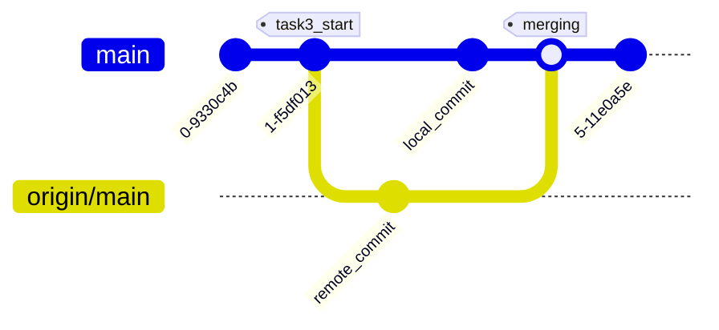

# Домашнее задание 1

## Задание 2

Содержимое папки hw1:

- complement.py

    Печатает комплементарную последовательность 5-3 и GC-состав. Принимает последовательность через обязательный аргумент --seq.

- count_kmers.py 
    Принимает входной файл в аргументе --fa, выходной --out(по умолчанию count_kmers_out.json), длину кмера --k (по умолчанию 4). Считает кмеры, результат печатает и сохраняет в выходной файл.   
- lgb.sh
    Много задачек для практики с гитом с [learngitbranching](https://learngitbranching.js.org)

## Задание 3 
Написала скрипт count_kmrs.py, который принимает имя входного файла, выходного и длину камера.
Закоммитила - тэг "task3_start". После этого в удаленном репозитории поменяла длину кмера по умолчанию 
с 2 на 4 и добавила комментарий под именем функции. В локальном репозитории добавила там же другой комментарий.

После этого попыталась сделать "git push" - на это git сказал, что в репозитории есть изменения, которых у меня нет,
и посоветовал сделать git pull. После этой команды в локальном репозитории появилась ветка origin/main с коммитом, 
сделанным удаленно. После этого запускаю git merge, разрешаю конфликт(удаляю значение по умолчанию в функции и меняю комментарий) 
и создаю коммит. Снова запускаю git push, изменеия из удаленного репозитория теперь включены и git не ругается.

*Сделать сразу как в задании не получилось*

